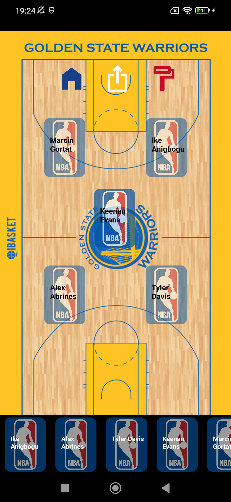
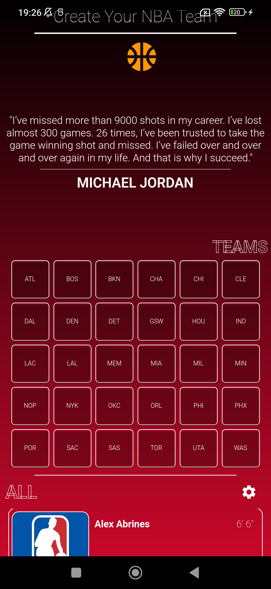

# createyournbateam
Create Your NBA Team App

## Getting Started
 

"Create Your NBA Team" application is a simple Flutter app developed using Bloc State Management.

In the app, you can double-click on the players from the API to add your desired NBA players to your own team. By tapping on the basketball icon at the top of the main page, you can navigate to your team page, where you can drag and drop the selected players into the boxes on the basketball court to position them as you like. If you need more features, you can capture a screenshot of your team using the sharing icon at the top of the team page and send it to your friends.

-This GitHub repository intentionally includes some gaps. Feel free to contribute by submitting a Pull Request-.

